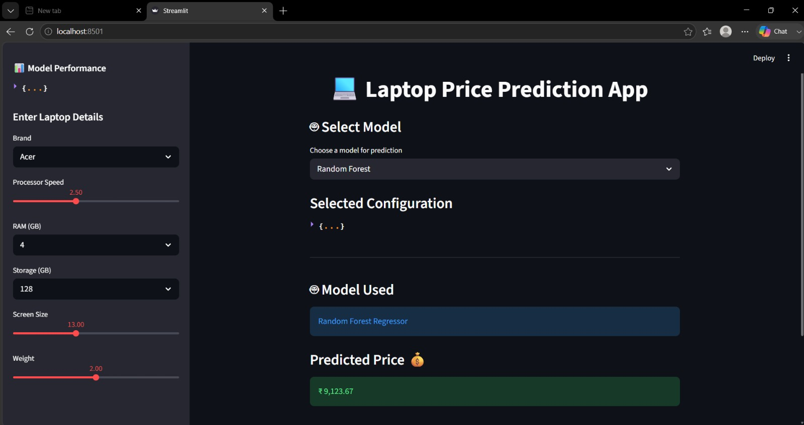

# 💻 Laptop Price Prediction App

## 📌 Project Overview

The **Laptop Price Prediction App** is a Machine Learning web application developed using **Python** and **Streamlit**. It predicts the estimated price of a laptop based on hardware specifications such as brand, processor speed, RAM, storage capacity, screen size, and weight.

The application also allows users to choose between multiple Machine Learning models to compare prediction results.

---

## 🚀 Features

- Interactive Streamlit web application
- Predict laptop prices instantly
- Compare multiple Machine Learning models
- User-friendly interface
- Display model performance (R² Score)
- Real-time price prediction
- Dynamic user inputs

---

## 🤖 Machine Learning Models Used

- Random Forest Regressor
- Linear Regression
- Decision Tree Regressor

---

## 🛠 Technologies Used

- Python
- Streamlit
- Pandas
- NumPy
- Scikit-learn
- Machine Learning
- Label Encoding

---

## 📂 Dataset

The project uses a laptop dataset containing the following features:

- Brand
- Processor Speed
- RAM Size
- Storage Capacity
- Screen Size
- Weight
- Price (Target Variable)

---

## 📷 Application Screenshots

### 🏠 Home Page



---

### ⚙️ Model Selection & Prediction


---

### 📋 Selected Configuration


---

## ▶️ How to Run the Project

### Clone the repository

```bash
git clone https://github.com/marynishitavatti/laptop-price-prediction.git
```

### Navigate to the project folder

```bash
cd laptop-price-prediction
```

### Install the required libraries

```bash
pip install pandas numpy scikit-learn streamlit openpyxl
```

### Run the Streamlit application

```bash
streamlit run app.py
```

---

## 📁 Repository Structure

```
Laptop-Price-Prediction/
│
├── app.py
├── Laptop_price dataset.xlsx
├── Laptop_Price_Prediction (4) (1).ipynb
├── home_page.png.jpeg
├── model_selection and predicted price.jpeg
├── selected configuration.jpeg
└── README.md
```

---

## 🎯 Future Improvements

- Deploy the application using Streamlit Community Cloud
- Add more Machine Learning models
- Improve prediction accuracy
- Enhance the user interface
- Include additional laptop specifications

---

Author
Vatti Mary Nishita

### Skills

- Python
- Machine Learning
- Streamlit
- SQL
- Power BI
- Data Analytics

---
